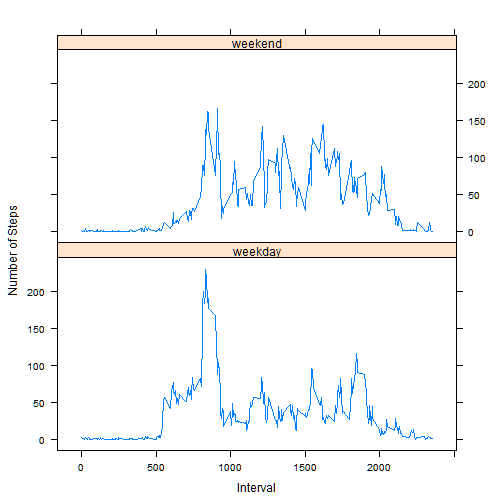

# Reproducible Research: Peer Assessment 1
==========================================

## Loading and preprocessing the data

The first step is to download the archive data file and uzip the csv file into the working directory. The program downloads the data and uzips it into the working directory.

```r
dataarchive <- "activity.zip"
datafile <- "activity.csv"
dataurl <- "https://d396qusza40orc.cloudfront.net/repdata%2Fdata%2Factivity.zip"
colclasses <- c("numeric",
                "character",
                "numeric")
# Download the file if it dosen't exist
if (!file.exists(dataarchive))
        download.file(dataurl, dataarchive, method = "curl")

# Read the data file
data <- read.csv(unz(dataarchive, datafile),
                 nrows = 17569,
                 comment.char = "",
                 colClasses = colclasses,
                 stringsAsFactors = FALSE)
```

After the data is read, convert the date columns (2nd column into Date data type).


```r
data$date <- as.Date(data$date, format = "%Y-%m-%d")
```

## What is mean total number of steps taken per day?

**Question 1a** -  We need to produce a histogram of the total number of steps taken each day. For that we can generate the plot using the following code.
The first step is to group the records by date. By doing so, we can calculate the total number of steps taken for each date. It is relatively easy to collapse data using the *'date'* variables and the **sum** function. We can store the result in a data frame so it is easy to retrieve data and perform advanced processing.


```r
result1 <- aggregate(steps~date, data=data, FUN="sum")
```


```r
plot(result1$date, result1$steps,
     xlab = "Date",
     ylab = "Total Number of Steps",
     type = "l")
```

 

**Question 1b** - We need to calculate and report the mean and median total number of steps taken per day.


```r
mymean<- mean(result1$steps)
mymedian <- median(result1$steps)
```

**Mean** - 1.0766 &times; 10<sup>4</sup>

**Median** - 1.0765 &times; 10<sup>4</sup>

## What is the average daily activity pattern?

**Question 2a** - We need to make a time series plot (i.e. type = "l") of the 5-minute interval (x-axis) and the average number of steps taken, averaged across all days (y-axis).


```r
result2 <- aggregate(steps~interval, data=data, FUN="mean")
plot(result2$interval, result2$step, type = "l", xlab = "Interval", ylab="Steps")
```

 


**Question 2b** - We need to calculate which 5-minute interval, on average across all the days in the dataset, contains the maximum number of steps. First we need to see which row has the maximum number of steps.


```r
maxvalue <- result2[which.max(result2$steps),]
```

So, the interval - 835 has the maximum number of steps - 1.0927 &times; 10<sup>4</sup>


## Imputing missing values

**Question 3a** - We need to calculate and report the total number of missing values in the dataset. 


```r
missingvaluecount <- sum(!complete.cases(data))
```

The number of rows with missing data is - 2304.


**Question 3b** - We need to devise a strategy for filling in all of the missing values in the dataset. ***For this exercise we need to fill in the missing values with the the average of the 5 minute interval***. 

- First we need to which rows have **NA** in the *steps* column.
- Second we need to create a function that returns the average for an interval from the *results2* variable.
- Third we need to replace all NAs with the appropriate interval average.


```r
intervalna <- data$interval[is.na(data$steps)]
index <- sapply(intervalna, function(x) which(result2$interval == x))
```


**Question 3c** - We need to create a new dataset that is equal to the original dataset but with the missing data filled in.


```r
data2 <- data
data2$steps[is.na(data2$steps)] <- result2$steps[index]
```

Now we have a dataset with all the missing values filled in. To compare 

*The original dataset*


```r
head(data, 5)
```

```
##   steps       date interval
## 1    NA 2012-10-01        0
## 2    NA 2012-10-01        5
## 3    NA 2012-10-01       10
## 4    NA 2012-10-01       15
## 5    NA 2012-10-01       20
```

*The modified dataset*


```r
head(data2, 5)
```

```
##     steps       date interval
## 1 1.71698 2012-10-01        0
## 2 0.33962 2012-10-01        5
## 3 0.13208 2012-10-01       10
## 4 0.15094 2012-10-01       15
## 5 0.07547 2012-10-01       20
```


**Question 3d** - Finally we need to make a histogram of the total number of steps taken each day and calculate and report the mean and median total number of steps taken per day. 


```r
result3 <- aggregate(steps~date, data=data2, FUN="sum")
plot(result3$date, result3$steps,
     xlab = "Date",
     ylab = "Total Number of Steps",
     type = "l")
```

 

Calculating the mean and the median for the new data set. 


```r
mymean3<- mean(result3$steps)
mymedian3 <- median(result3$steps)
```

**Mean** - 1.0766 &times; 10<sup>4</sup>

**Median** - 1.0766 &times; 10<sup>4</sup>

From the above results we notice that the mean values remain the same. The median value is very close to the original value. 


## Are there differences in activity patterns between weekdays and weekends?

**Question 4a** - First we need to create a new factor variable in the dataset with two levels - "weekday" and "weekend" indicating whether a given date is a weekday or weekend day.


```r
data2$weekpart <- as.factor(ifelse(weekdays(data2$date) %in% c("Saturday","Sunday"),"weekend", "weekday"))
```


**Question 4b** - Next we need to make a panel plot containing a time series plot (i.e. type = "l") of the 5-minute interval (x-axis) and the average number of steps taken, averaged across all weekday days or weekend days (y-axis). We will use the lattice system to plot the graph.


```r
result4 <- aggregate(steps~interval+weekpart, data=data2, FUN="mean")
library(lattice)
xyplot(steps ~ interval | weekpart, data = result4, layout = c(1, 2), type = "l", xlab = "Interval", ylab = "Number of Steps")
```

 

